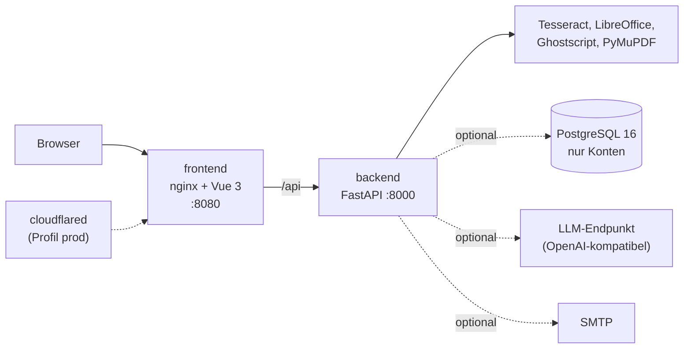

# PDF-Editor-App

[](https://github.com/janpow77/pdf-editor/actions/workflows/image.yaml)

**Web-App mit PDF-, Word- und Excel-Werkzeugen: kostenlos, ohne Registrierungszwang, ohne
Datenspeicherung. Alle Dateien werden ausschließlich im Arbeitsspeicher des Servers verarbeitet
und nie persistiert.**

## Auf einen Blick

- **47 Werkzeuge** für PDF sowie Word und Excel: Text bearbeiten, Anmerkungen, Zusammenführen,
  Teilen, Seiten ordnen, OCR, Schwärzen, Formular-Designer, PDF/A, digitale Signatur,
  PDF → Word/Excel, Office → PDF, Word-Vergleich u. a. (Katalog: `backend/app/tool_catalog.py`).
- **Ohne Konto nutzbar.** Optionale Benutzerkonten (offene Registrierung) bringen höhere Limits
  (100 MB statt 50 MB pro Datei) und gespeicherte Werkzeug-Einstellungen.
- **Läuft auch ohne Datenbank:** Ist PostgreSQL nicht erreichbar, arbeitet die App automatisch
  im rein anonymen Modus weiter.
- **Werkzeug-Freigabe im Admin-Bereich** (`/admin`): Einzelne Werkzeuge lassen sich auf
  angemeldete Nutzer beschränken. Anonyme Besucher sehen sie ausgegraut, der Server weist sie
  mit HTTP 403 ab.
- **Optionale KI-Funktionen nur über eigene Infrastruktur** (OpenAI-kompatibler Endpunkt), keine
  Cloud. Ohne Konfiguration sind sie abgeschaltet.
- **Sichtbare Degradation:** Fehlen OCR- oder Office-Komponenten, zeigt `/api/health` das über
  Feature-Flags an.

## Architektur



## Schnellstart

**Docker (Gesamtstack)**, Voraussetzung: Docker mit Compose-Plugin.

```bash
cp .env.example .env
# In .env mindestens PDFAPP_SECRET_KEY und PDFAPP_DB_PASSWORD setzen,
# z. B. jeweils mit: openssl rand -hex 32
docker compose up --build
# → http://localhost:8080 (nginx: Frontend + Proxy /api → Backend)
```

Ohne `PDFAPP_SECRET_KEY` und `PDFAPP_DB_PASSWORD` bricht `docker compose` ab.

<details>
<summary><b>Lokale Entwicklung ohne Docker</b></summary>

Voraussetzungen: Python 3.12 (wie im Backend-Image), Node.js mit npm.

```bash
# Backend
cd backend
python -m venv .venv && source .venv/bin/activate
pip install -r requirements-dev.txt
pytest tests/                       # Tests
uvicorn app.main:app --port 8000    # API auf :8000, Docs unter /docs

# Frontend (zweites Terminal)
cd frontend
npm install
npm run dev                         # http://localhost:3010 (Proxy /api → :8000)
```

Für OCR und Office → PDF müssen lokal `tesseract-ocr` (Sprachpakete `-deu`, `-eng`,
optional `-fra/-ita/-spa/-nld/-pol`) und `libreoffice-writer`/`-calc`/`-impress` installiert
sein. Ohne sie degradieren die betroffenen Werkzeuge sichtbar (Feature-Flags in `/api/health`).

</details>

<details>
<summary><b>Konfiguration (Umgebungsvariablen)</b></summary>

Alle Einstellungen laufen über Umgebungsvariablen mit Präfix `PDFAPP_`, vollständig in
[.env.example](./.env.example) und `backend/app/config.py`. Die wichtigsten:

| Variable | Default | Zweck |
|---|---|---|
| `PDFAPP_SECRET_KEY` | — | Pflicht (JWT-Signatur), `openssl rand -hex 32` |
| `PDFAPP_DB_PASSWORD` | — | Pflicht (Postgres-Passwort im Compose) |
| `PDFAPP_ADMIN_EMAIL` / `_PASSWORD` | *(leer)* | Admin-Seed beim ersten Start (idempotent) |
| `PDFAPP_MAX_FILE_SIZE_MB` | 50 | Limit pro Datei (anonym) |
| `PDFAPP_MAX_TOTAL_SIZE_MB` | 200 | Limit pro Multi-Datei-Operation (anonym) |
| `PDFAPP_MAX_FILE_SIZE_MB_AUTHED` | 100 | Limit pro Datei (angemeldet) |
| `PDFAPP_MAX_TOTAL_SIZE_MB_AUTHED` | 400 | Limit pro Operation (angemeldet) |
| `PDFAPP_RATE_LIMIT_DEFAULT` | `30/minute;500/day` | Rate-Limit pro IP (anonym) |
| `PDFAPP_RATE_LIMIT_AUTHED` | `60/minute;2000/day` | Rate-Limit pro Nutzer (angemeldet) |
| `PDFAPP_RATE_LIMIT_MAIL` | `5/hour` | Rate-Limit Mailversand |
| `PDFAPP_SMTP_HOST` | *(leer)* | leer = Mailversand deaktiviert (503) |
| `PDFAPP_LLM_URL` | *(leer)* | OpenAI-kompatibler Endpunkt der eigenen Infrastruktur; leer = KI-Funktionen deaktiviert, keine Cloud |
| `PDFAPP_LLM_MODEL` | `qwen3.5:35b` | Modellname für die KI-Funktionen |

Weitere Schalter (SMTP-Zugang, `PDFAPP_PUBLIC_BASE_URL`, `PDFAPP_HSTS_SECONDS`,
`PDFAPP_SOURCE_URL`, Turnstile, `PDFAPP_TRUST_CF_HEADER`, `PDFAPP_IMAGE_TAG`) sind in
[.env.example](./.env.example) kommentiert.

</details>

<details>
<summary><b>Datenbank-Migrationen (Alembic)</b></summary>

Frische Datenbanken initialisiert der Backend-Start selbst (`create_all` + Admin-Seed). Für
Schema-Änderungen an bestehenden Datenbanken:

```bash
cd backend
alembic upgrade head        # nutzt PDFAPP_DATABASE_URL aus der Umgebung
alembic revision -m "..."   # neue Migration anlegen
```

Die Initial-Migration `0001` ist idempotent und läuft auch auf per `create_all` erzeugten
Beständen sauber durch (zieht fehlende Spalten nach).

</details>

<details>
<summary><b>Betrieb und Deployment</b></summary>

Die öffentliche Instanz läuft unter `pdf.flowaudit.de` hinter einem Cloudflare-Tunnel. Das
Compose-Profil `prod` startet zusätzlich `cloudflared`; das Token kommt als `TUNNEL_TOKEN` in die
Env-Datei:

```bash
docker compose --profile prod pull
docker compose --profile prod up -d
curl -s https://pdf.flowaudit.de/api/health   # → "status": "ok"
```

GitHub Actions baut bei jedem Push auf `main` (und bei Tags `v*`) die Container-Images und legt
sie als `ghcr.io/janpow77/pdf-editor-{backend,frontend}` ab
([.github/workflows/image.yaml](./.github/workflows/image.yaml)), jeweils mit Tag `latest` und
Commit-SHA. Über `PDFAPP_IMAGE_TAG=<commit-sha>` lässt sich ein früherer Stand pinnen. Ohne
GHCR-Zugriff bleibt `--profile prod up -d --build` als Rückfallebene.

Ablage auf dem Server, Tunnel-Einrichtung, Sicherung, Aktualisierung und Rückfall beschreibt
[BETRIEB.md](./BETRIEB.md).

</details>

<details>
<summary><b>Herkunft des Codes</b></summary>

Backend-Services und Tool-Komponenten sind Kopien aus dem audit_designer-Repo
(`backend/app/services/pdf_{tools,editor}_service.py`, `frontend/src/components/vpai/pdf-tools/`),
entkoppelt von Auth, Stores und Feature-Flags. Die App ist bewusst import-frei gegenüber
audit_designer und als eigenständiges Repository lauffähig.

</details>

## Dokumentation

- [KONZEPT.md](./KONZEPT.md): Ziel, Funktionsumfang, Architektur, Datenschutz, Härtung,
  Soll-Kriterien und Roadmap
- [MODULKATALOG_2026.md](./MODULKATALOG_2026.md): Abdeckungsanalyse gegen ein 18-Modul-Zielbild
- [FRONTEND_REFACTORING.md](./FRONTEND_REFACTORING.md): Aufbau der Oberfläche
- [BETRIEB.md](./BETRIEB.md): Inbetriebnahme, Deployment und laufender Betrieb

## Lizenz

<!-- TODO: Im Repository liegt keine LICENSE-Datei. Lizenz festlegen und hier eintragen. -->
Eine Lizenzdatei fehlt bisher. PyMuPDF und Ghostscript stehen unter der AGPL-3.0; Betreiber
einer öffentlichen Instanz müssen den Quelltext erreichbar machen (`PDFAPP_SOURCE_URL`, Details
in [KONZEPT.md](./KONZEPT.md), Abschnitt „Lizenzlage und Quelltextpflicht“). Die Lizenzseite der
App (`/api/licenses`) listet alle Komponenten mit ihren Lizenzen.
